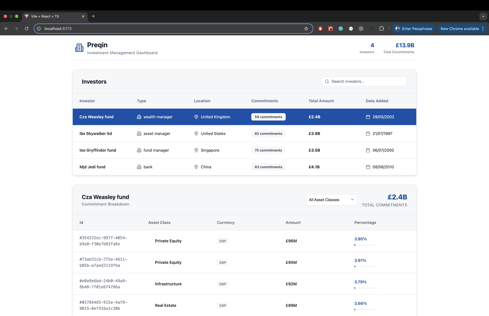

# 🧠 Investment Platform Dashboard

A full-stack, microservices-based dashboard for managing and visualizing investor commitments across various asset classes.



---

## 🚀 Features

- 🔍 Investor and asset class breakdowns
- 📊 Interactive commitment visualizations
- 🌐 GraphQL Gateway for data aggregation
- 🧱 Microservices architecture
- 🐳 Fully Dockerized for easy setup

---

## 📦 Tech Stack

- **Frontend:** Vite + React + TypeScript
- **GraphQL Gateway:** Strawberry (Python)
- **Services:** FastAPI (Python)
- **Databases:** MongoDB, SQLite
- **Caching & Pub/Sub:** Redis
- **Containerization:** Docker, Docker Compose

---

## ⚙️ Getting Started

> All services are containerized. To start the entire application:

```bash
docker-compose up --build
```

Once everything is up, you can access the frontend at:

👉 http://localhost:5173

This is the main dashboard UI for viewing investors, asset classes, and commitments.
